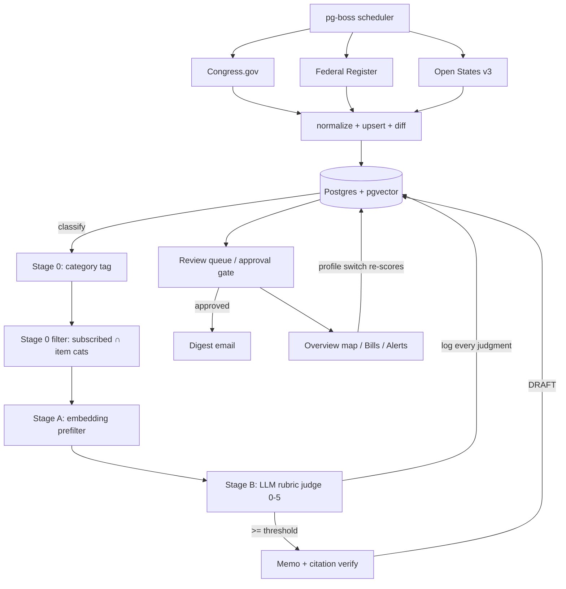

<div align="center">

# 🟥 RedLine

### Regulatory watch for small business

**Ingest every bill and rule moving through U.S. government → score what threatens *your* business → deliver a cited, plain-English brief.**
Open-source. Self-hostable. Built so an AI agent reading 130,000+ bills does the work a $500/hr policy consultant does - in seconds, for businesses that could never afford one.

`MASTER BUILD SPEC` · `v1` · single source of truth for the repo and for Claude Code

</div>

---

> **For the build agent:** Read this whole file plus `CLAUDE.md` before writing code. This is the contract. The data model and the interfaces in §6–§7 are the integration points every module shares - don't drift from them. Where this spec and a generated demo disagree, this spec wins.

> **Non-negotiables (full detail in §15):** open-source deps only (MIT/Apache); secrets in `.env`, never committed; **never ship a fabricated dollar figure, probability, or vote prediction**; **never build a directory of named individuals' personal contact info**; clone the *idea*, not anyone's brand/copy. The eval harness ships in the first hour and gates every prompt change.

---

## Table of contents

1. [What RedLine is](#1-what-redline-is)
2. [Product surface](#2-product-surface)
3. [System architecture](#3-system-architecture)
4. [Tech stack & the open-source reasoning](#4-tech-stack--the-open-source-reasoning)
5. [Data sources](#5-data-sources)
6. [Data model](#6-data-model)
7. [The pipeline (the core engine)](#7-the-pipeline-the-core-engine)
8. [Trust layer](#8-trust-layer)
9. [The regulation taxonomy](#9-the-regulation-taxonomy)
10. [Onboarding → business profile](#10-onboarding--business-profile)
11. [The eval matrix](#11-the-eval-matrix)
12. [Design system](#12-design-system)
13. [Repository structure & doc map](#13-repository-structure--doc-map)
14. [Build phases (agent-driven)](#14-build-phases-agent-driven)
15. [Guardrails & non-negotiables](#15-guardrails--non-negotiables)

---

## 1. What RedLine is

**The problem.** Every business is affected by regulation, and most find out too late. The real-world failure mode: a routine bill gets a last-minute amendment, or a rule's comment window closes, and a business that would've been hit never sees it coming. Big companies pay $30K/month lobbyists to watch for this. Everyone else gets blindsided.

**What RedLine does.** AI agents continuously read public legislative + regulatory data across all 50 states and the federal government, score each item against *your specific business*, and produce a short cited brief: what the rule does, where it is in the process, who it hits, and the recommended action. The model work is ~5% of this; the product is the **filter + the trust** (coverage, precision, citations, audit).

**Horizontal by design - works for any small business.** Relevance can't come from one fixed industry. Every business has two layers of exposure:
- a **base layer** they all share as an employer + operator (wages, leave, classification, licensing, taxes, privacy, safety, accessibility), and
- **business-type modules** that toggle on at onboarding: **`software`**, **`goods`**, **`food`**, **`hardware`**.

A SaaS company = base + `software`; a food maker = base + `food`. You build ~8 base categories + 4 modules once, and any real business is a combination. The signature interaction (the "Viewing as" switch) re-scores the entire board when you change which business you're looking at - the same rule is a five-alarm threat to one business and pure noise to another.

**Who it's for (the wedge).** Incumbents (FiscalNote, Quorum, Plural) charge five-to-six figures and sell top-down to enterprise government-affairs teams. RedLine's opening is **SMBs, startups, e-commerce sellers, food makers, and trade-association members** who currently get nothing. Distribution wins this, not the model - go in through one community at a time even though the engine is general.

**What we deliberately DON'T build** (and why - this matters):
- ❌ **Fabricated impact dollar figures** ("$142M at risk"). An LLM will invent confident numbers on demand. We show qualitative impact + a *clearly-labeled* estimate with stated assumptions the user can edit, never a hero number presented as calculated.
- ❌ **Outcome/whip-count predictions** ("likely yes 5, swing 3, Sen. X wants to vote no…"). We show *factual* upcoming events (hearing dates, comment deadlines, status changes), not invented vote forecasts about named people.
- ❌ **A directory of named individuals' personal phone numbers.** That's PII, and the lobbyist-relationship layer is a forward-deployed-services moat, not a vibe-codeable feature. Recommended action is "submit a comment / talk to counsel / monitor," with links to *official* public portals (e.g., Regulations.gov comment page), not someone's cell.
- ❌ **Auto-send of anything.** Memos are drafts until a human approves (§8).

---

## 2. Product surface

Three tabs in one app shell, plus the persistent **profile switcher** in the top bar.

### Overview (the map)
The hero. A US choropleth shaded by threat status for the business you're viewing as, with **floating annotation cards** that auto-cycle through the top surfaced items:
- **`THREAT` / `THE MOVE`** - the headline analysis: what just changed (e.g., an amendment that transformed a routine bill), with **provenance** ("near-identical to a failed bill in another state; originated from X model legislation"). Provenance is legit and powerful - it's sourced, not invented.
- **`STATUS`** - factual next events: committee hearing date, comment-period close date, last action. No predicted vote counts.
- **`IMPACT`** - qualitative "why this matters to you," plus a *labeled* estimate ("Estimated impact - assumptions: …") only when grounded. Never a bare fabricated figure.
- **`ACTION`** - recommended action (Comment / Monitor / Call counsel) + a link to the official comment portal or bill page.

Left rail: **`SURFACED THREATS`** - the scored, sorted list for the current business, with a `NEW` badge on fresh items and a footer count ("Monitoring 130,000+ items across 50 states + Congress"). Top bar: tabs, a "last sync" indicator, and an "auto-cycling" toggle for the floating cards.

### Bills (the feed)
The full scored list (what `redline-dashboard.jsx` already prototypes): each item a card with a **severity stamp** (`0–5` + Critical/High/Monitor), identifier, source, category chips, status, the per-you justification, and Track. Clicking opens the **memo slide-over** (what it does / status & next steps / who's affected / recommended action / verified citations). A "N items filtered out as low relevance" expander makes precision visible.

### Alerts (review + delivery)
The **review queue** (approval gate): drafted memos sit as `Draft` until approved - nothing goes out otherwise. Plus digest settings (daily/weekly email) and comment-deadline alerts.

### Tracker
A kanban of followed items by normalized legislative stage (Proposed → Comment open → Finalized → In effect → Contested/Vacated).

**Signature interaction.** The top-bar **"Viewing as {business}"** switch re-scores and re-sorts everything live, recoloring each severity stamp. It is the one memorable thing; keep everything else quiet around it.

---

## 3. System architecture

```
                    ┌─────────────────────────────────────────────┐
                    │  pg-boss scheduler (cron, in Postgres)        │
                    │  hourly: federal   ·   daily: states          │
                    └──────┬──────────────┬──────────────┬──────────┘
            ┌──────────────▼──┐ ┌─────────▼────────┐ ┌───▼───────────────┐
            │ Congress.gov     │ │ Federal Register │ │ Open States v3     │  SourceClient
            │ (cursor+backoff) │ │ (full-text srch) │ │ (per-state)        │  (one interface)
            └──────────┬───────┘ └────────┬─────────┘ └───┬───────────────┘
                       └───── normalize ───┴───────────────┘
                                    │  upsert + diff → status_history
                                    ▼
                        ┌───────────────────────────────┐
                        │ Postgres + pgvector             │
                        │ items · item_status_history     │
                        │ org_profiles (attrs+embedding)  │
                        │ relevance_judgments (LOG)       │
                        │ memos · tracked_items · audit   │
                        └───────────┬─────────────────────┘
                                    │  classify categories at ingest
                                    ▼
       ┌──────────────── Relevance pipeline (per business) ──────────────────┐
       │ Stage 0  category intersection (subscribed cats ∩ item cats)        │
       │ Stage A  pgvector prefilter (profile_embedding <=> item.embedding)  │
       │ Stage B  LLM rubric judge → {score 0–5, justification}  → LOG all   │
       └───────────────┬──────────────────────────────────────────────────────┘
                       │  score ≥ MEMO_THRESHOLD
                       ▼
            ┌───────────────────────────────┐
            │ Memo generator                 │
            │ fetch full text → chunk →       │
            │ structured memo + citations →   │
            │ VERIFY citations resolve →      │
            │ status = DRAFT (approval gate)  │
            └───────────────┬─────────────────┘
                            ▼
   ┌──────── Delivery ────────┐     ┌──────────── Web app (Next.js) ────────────┐
   │ Daily/weekly digest      │     │ Overview map · Bills feed · Alerts/review  │
   │ (SMTP) of APPROVED items │     │ Tracker · "Viewing as" profile switcher    │
   └──────────────────────────┘     └────────────────────────────────────────────┘
```



---

## 4. Tech stack & the open-source reasoning

**One language - TypeScript / Next.js - for everything.** The "data-heavy" parts here are HTTP polling of JSON APIs + an embeddings call + an LLM call. No pandas, no training. One repo, one deploy, faster to build and to publish open-source.

| Concern | Pick | License / notes |
|---|---|---|
| App + API + dashboard | **Next.js 15 (App Router)** | MIT |
| DB | **Postgres + pgvector** | OSS |
| ORM / migrations | **Drizzle** | Apache-2.0; pairs well with agents |
| Jobs + scheduling | **pg-boss** | MIT - Postgres-backed queue *and* cron; zero extra infra; self-hostable |
| LLM | **Claude via API** behind an `LLM` interface | external service; interface allows Ollama/Llama swap for full self-host |
| Embeddings | behind an `Embedder` interface | fast path: an embeddings API; OSS-clean default: local `nomic-embed-text` (Ollama) or `bge-small-en` (transformers.js) |
| Email | **Nodemailer + SMTP** behind a `Mailer` interface | MIT; any SMTP; Resend adapter optional |
| Auth | **Auth.js** email magic-link | ISC/MIT; stub day 1, wire later |
| Validation | **Zod** | MIT; also constrains LLM JSON output |
| Map | **react-simple-maps** + us-atlas TopoJSON | MIT / public-domain geography |
| UI icons | **lucide-react** | ISC |

**Closed-dependency flags (decide consciously):** the only non-OSS pieces by default are the **LLM** and **embeddings** - both behind interfaces, both swappable to local models for a 100%-self-hosted deploy (keep Claude for triage/memo quality, document the Ollama fallback). We replaced the common SaaS defaults - **pg-boss instead of Inngest**, **Nodemailer/SMTP instead of Resend** - to keep the core open and self-hostable; both originals remain as optional adapters.

---

## 5. Data sources

Federal-first (richest, most reliable APIs), states next.

| Source | Gives you | Auth | Limits / gotchas |
|---|---|---|---|
| **Congress.gov API v3** | Federal bills, actions, amendments, cosponsors, committees, subjects, summaries, **text versions** | Free key (api.data.gov) | **5,000 req/hr**, ≤250/page. **No full-text search on list** - filter by congress/type/date; use `fromDateTime`/`toDateTime` (update-time → incremental polling). Fetch text per-bill. |
| **Federal Register API v1** | Proposed/final rules, notices, presidential docs; **full-text search**; comment-period metadata | **No key** | Generous. Best for rules + comment deadlines + executive actions. |
| **Regulations.gov API v4** | Dockets, documents, **comments + comment close dates** | Free key (api.data.gov) | ~1,000 req/hr. Powers comment-deadline alerts. |
| **Open States / Plural v3** | **All 50 states + DC + PR**: bills (full-text search), actions, sponsors, votes, legislators | Free key (`apikey`) | GraphQL v2 sunset - use **v3 REST**. Coverage/latency varies by state. Commercial limits emerging → for scale, self-host their OSS scrapers / bulk data. |
| **LegiScan** (backup) | 50-state bills, full text, status | Free key + bulk | Cross-check states where Open States lags. |

**Known coverage gap to document, not hide:** much of what hits a business is **state *regulation*, not statute** (e.g., a state agency rulemaking), which lives in each state's **regulatory register / OAL-equivalent** - *not* in Open States (bills only) and *not* in the Federal Register (federal only). MVP wired to "Open States + Federal Register" will look complete and silently miss state agency rulemakings. Ship it as a labeled gap; roadmap a per-state regulatory-register scraper.

**Key design consequence:** you cannot keyword-search Congress.gov server-side. For every source: **poll "changed since cursor" → normalize → upsert → classify + embed → filter locally.**

---

## 6. Data model

Multi-tenant from line one (`org_id` everywhere). SQL for clarity; mirror in `db/schema.ts` (Drizzle).

```sql
-- ⚠️ EMBED_DIM must match the embedder: OpenAI 3-small=1536 | nomic-embed=768 | bge-small=384
CREATE EXTENSION IF NOT EXISTS vector;

CREATE TABLE organizations (
  id uuid PRIMARY KEY DEFAULT gen_random_uuid(),
  name text NOT NULL, created_at timestamptz NOT NULL DEFAULT now());

CREATE TABLE users (
  id uuid PRIMARY KEY DEFAULT gen_random_uuid(),
  org_id uuid NOT NULL REFERENCES organizations(id),
  email text UNIQUE NOT NULL, role text NOT NULL DEFAULT 'member',
  created_at timestamptz NOT NULL DEFAULT now());

-- the business profile (built from onboarding)
CREATE TABLE org_profiles (
  id uuid PRIMARY KEY DEFAULT gen_random_uuid(),
  org_id uuid NOT NULL REFERENCES organizations(id),
  business_types text[] NOT NULL DEFAULT '{}',     -- ['software','goods',...]
  jurisdictions  text[] NOT NULL DEFAULT '{}',     -- ['us','us-ca',...]
  attributes     jsonb  NOT NULL DEFAULT '{}',     -- employees, has_1099, imports, serves_food, ...
  subscribed_categories text[] NOT NULL DEFAULT '{}',
  concern_text   text,                              -- generated; encodes positives AND negatives
  embedding      vector(1536),
  is_active boolean NOT NULL DEFAULT true,
  created_at timestamptz NOT NULL DEFAULT now());

-- unified legislative/regulatory item (bills AND rules); type discriminates
CREATE TABLE items (
  id uuid PRIMARY KEY DEFAULT gen_random_uuid(),
  source text NOT NULL,            -- congress | federal_register | regulations_gov | openstates
  external_id text NOT NULL,
  jurisdiction text NOT NULL,      -- 'us','us-ca',...
  type text NOT NULL,              -- bill | resolution | proposed_rule | final_rule | notice | docket
  identifier text, title text NOT NULL, summary text,
  full_text_url text, full_text text,
  status text, stage text,         -- stage = normalized lifecycle bucket (see §2 Tracker)
  introduced_date date, last_action_date timestamptz, last_action_text text,
  comment_close_date date,
  sponsors jsonb NOT NULL DEFAULT '[]', subjects text[] NOT NULL DEFAULT '{}',
  categories text[] NOT NULL DEFAULT '{}',  -- taxonomy tags (§9), set at ingest
  raw jsonb NOT NULL, content_hash text NOT NULL,
  embedding vector(1536),
  first_seen_at timestamptz NOT NULL DEFAULT now(),
  last_synced_at timestamptz NOT NULL DEFAULT now(),
  updated_at timestamptz NOT NULL DEFAULT now(),
  UNIQUE (source, external_id));
CREATE INDEX ON items USING hnsw (embedding vector_cosine_ops);
CREATE INDEX ON items USING gin (categories);
CREATE INDEX ON items (jurisdiction, last_action_date DESC);

-- append-only status history: the "no missed amendment" backbone + tracker
CREATE TABLE item_status_history (
  id uuid PRIMARY KEY DEFAULT gen_random_uuid(),
  item_id uuid NOT NULL REFERENCES items(id),
  status text, action_text text, action_date timestamptz,
  raw jsonb, recorded_at timestamptz NOT NULL DEFAULT now());

-- THE trust-tuning log: every relevance decision, with versions, forever
CREATE TABLE relevance_judgments (
  id uuid PRIMARY KEY DEFAULT gen_random_uuid(),
  item_id uuid NOT NULL REFERENCES items(id),
  org_id uuid NOT NULL REFERENCES organizations(id),
  stage text NOT NULL,             -- category | prefilter | llm_judge
  score int, similarity double precision,
  justification text, matched_concern text,
  model text, prompt_version text, rubric_version text,
  created_at timestamptz NOT NULL DEFAULT now());
CREATE INDEX ON relevance_judgments (org_id, created_at DESC);

-- cited memo; DRAFT until a human approves (approval gate)
CREATE TABLE memos (
  id uuid PRIMARY KEY DEFAULT gen_random_uuid(),
  item_id uuid NOT NULL REFERENCES items(id),
  org_id uuid NOT NULL REFERENCES organizations(id),
  judgment_id uuid REFERENCES relevance_judgments(id),
  what_it_does text, status_and_next_steps text, who_is_affected text,
  recommended_action text,          -- comment | monitor | call_counsel | no_action
  recommended_action_note text,
  impact_estimate text,             -- LABELED estimate + assumptions; NEVER a bare fabricated number
  citations jsonb NOT NULL DEFAULT '[]',  -- [{claim,snippet,locator,verified}]
  confidence text, model text, prompt_version text,
  status text NOT NULL DEFAULT 'draft',   -- draft | approved | rejected | sent
  approved_by uuid REFERENCES users(id), approved_at timestamptz,
  created_at timestamptz NOT NULL DEFAULT now());

CREATE TABLE tracked_items (
  id uuid PRIMARY KEY DEFAULT gen_random_uuid(),
  org_id uuid NOT NULL REFERENCES organizations(id),
  item_id uuid NOT NULL REFERENCES items(id),
  note text, added_at timestamptz NOT NULL DEFAULT now(),
  UNIQUE (org_id, item_id));

-- 👍/👎 on flagged items → labels that feed the eval set
CREATE TABLE relevance_feedback (
  id uuid PRIMARY KEY DEFAULT gen_random_uuid(),
  org_id uuid NOT NULL REFERENCES organizations(id),
  item_id uuid NOT NULL REFERENCES items(id),
  judgment_id uuid REFERENCES relevance_judgments(id),
  user_id uuid REFERENCES users(id),
  label text NOT NULL,             -- relevant | not_relevant
  created_at timestamptz NOT NULL DEFAULT now());

CREATE TABLE audit_log (
  id uuid PRIMARY KEY DEFAULT gen_random_uuid(),
  org_id uuid REFERENCES organizations(id),
  actor text NOT NULL,             -- user uuid or 'system'
  action text NOT NULL, entity_type text NOT NULL, entity_id uuid,
  before jsonb, after jsonb, created_at timestamptz NOT NULL DEFAULT now());

CREATE TABLE sync_state (
  source text PRIMARY KEY, cursor text, last_run_at timestamptz);
```

---

## 7. The pipeline (the core engine)

**Interfaces (the shared contract):**
```ts
interface SourceClient {
  key: 'congress' | 'federal_register' | 'openstates' | 'regulations_gov';
  fetchSince(cursor: string | null): Promise<{ items: NormalizedItem[]; cursor: string }>;
  fetchFullText?(item: NormalizedItem): Promise<string | null>;
}
interface Embedder { dim: number; embed(texts: string[]): Promise<number[][]>; }
interface LLM { json<T>(a: { system: string; user: string; schema: ZodSchema<T>; model?: string }): Promise<T>; }
interface Mailer { send(a: { to: string; subject: string; html: string }): Promise<void>; }
```

**Stage 0 - category tagging + intersection.** At ingest, tag each item with taxonomy categories (§9) via cheap agency/keyword rules first (FDA+"food"→`food`; CBP/"de minimis"/"tariff"→`goods`,`hardware`; DOL/"overtime"→`wages_hours`), upgrade to a small LLM classifier later. Tag generously (recall first). Then keep only items whose `categories` intersect the business's `subscribed_categories`. This is why a food rule never reaches a SaaS company's judge. ⚠️ Also a silent-recall risk - audit tagging against the eval set.

**Stage A - pgvector prefilter.**
```sql
SELECT i.id, 1 - (i.embedding <=> $1) AS similarity
FROM items i
WHERE i.jurisdiction = ANY($2) AND i.categories && $3 AND i.last_synced_at > $4
ORDER BY i.embedding <=> $1 LIMIT 50;
```

**Stage B - LLM rubric judge.** Real prompt (full versions live in `docs/PROMPTS.md`; bump `rubric_version` on every change):
```
SYSTEM: You score how much one legislative/regulatory item threatens or affects ONE
business. Judge ONLY on what the item says. Don't assume provisions not present. If too
vague to assess, score low and say so. Never invent section numbers. Output ONLY JSON.
Rubric 0–5:
 5 Direct material impact - new obligations/costs/restrictions on this org's core ops, action now.
 4 Clearly relevant - regulates this org's activities; would likely require a change or position.
 3 Sector-adjacent - touches the broader sector; monitor.
 2 Weak/indirect - affects industry only via suppliers/customers, not the org.
 1 Background noise - shares keywords, different context.
 0 Irrelevant.
USER: {profile: industry/types/attributes/concern_text} + {item: jurisdiction,type,id,title,summary,excerpt}
Return JSON: {"score":int,"justification":"one concrete sentence naming the provision/reason",
"matched_concern":"which profile element, or null"}
```
Validate with Zod; **log every judgment** to `relevance_judgments` with `model`/`prompt_version`/`rubric_version`.

**Memo generator** (score ≥ `MEMO_THRESHOLD`, default 4): ensure full text (lazy) → chunk + retrieve sections most similar to the concern → generate structured memo → **verify every citation is a whitespace-normalized substring of the source** (drop/flag if not - the substring check, not the model, decides) → save `status='draft'`. Forbid fabricated dollar figures; `impact_estimate` is a labeled estimate with assumptions or empty.

---

## 8. Trust layer

The 95% of the product. Build it from commit #1.

- **Eval harness (highest-leverage thing).** Golden cases in `/evals/cases/*.json`, runner `evals/run.ts` executes Stage B per case, reports **precision / recall / F1**, prints every **false negative** loudly, and exits non-zero below `evals/thresholds.json` (CI fails). `npm run eval` after every prompt/rubric change. Build the set from real history (see §11).
- **Approval gate.** Memos/outbound start `draft`; a human approves before send. No auto-send in v1. Review queue is first-class.
- **Audit log.** Every state change → `audit_log` with before/after. Trust feature + debugger.
- **Provenance.** Memo claims link to verified source snippets; item detail shows full status history with raw payloads.
- **Feedback loop.** 👍/👎 on flagged items → `relevance_feedback` → new eval labels.
- **No fabrication.** Enforced in prompts *and* in code (reject memos with unlabeled numeric impact claims; never emit predicted vote counts or named-contact info).
- **Calibration honesty.** You can't prove "no missed bills." The eval set is the evidence, and only for the categories/states you've labeled. Say so; gate immature modules as "beta."

---

## 9. The regulation taxonomy

**BASE (every business):** `wages_hours` · `leave_benefits` · `classification_scheduling` · `licensing_registration` · `taxes` · `data_privacy` · `workplace_safety` · `accessibility`. *(Most base law is **state** - federal is the floor; expand states early.)*

**MODULE `software`** - consumer privacy/data security, children's privacy (COPPA), AI rules, subscription/auto-renewal (negative option), consumer-protection/UDAP.
**MODULE `goods`** - sales-tax nexus, import duties/customs (de minimis/tariffs), marketplace-seller rules, labeling, packaging/EPR.
**MODULE `food`** - food safety & traceability (FSMA), labeling, health permits, alcohol licensing. *Supply-chain role matters: a maker/distributor is covered by far more than a dine-in-only restaurant.*
**MODULE `hardware`** - product safety (CPSC), device/equipment authorization (FCC), energy efficiency (DOE), e-waste/right-to-repair, plus everything in `goods`.

Items get `categories[]`; profiles get `subscribed_categories[]` (= base + modules from onboarding). Relevance = Stage-0 category intersection + Stage-A embedding + Stage-B judge.

---

## 10. Onboarding → business profile

Onboarding *is* part of the engine. Questions → structured `attributes` → derived `business_types` + `subscribed_categories` + generated `concern_text`.

**Questions → fields:** states you operate in → `jurisdictions`; what you do (software / goods / hardware / food) → `business_types` (toggles modules); employee count + W-2? + 1099? → base employment cats; sell a subscription? → `software`:negative-option; import anything? → customs; collect customer data online? children <13? → `data_privacy`/COPPA; for food, *make/pack/hold* vs *only serve*? → FSMA scope.

**Example profile** (note the negatives - they make the judge *reject* off-target rules):
```json
{
  "business_types": ["software"], "jurisdictions": ["us","us-ca"],
  "attributes": { "employees":12,"has_w2":true,"has_1099_contractors":true,
    "sells_subscription":true,"imports_goods":false,"sells_physical_goods":false,
    "serves_food":false,"collects_customer_data_online":true,"data_from_children_under_13":false },
  "subscribed_categories": ["wages_hours","leave_benefits","classification_scheduling",
    "licensing_registration","taxes","data_privacy","workplace_safety","accessibility","software"],
  "concern_text": "Fully-remote B2B SaaS in CA, 12 W-2 staff + 1099 contractors, sells auto-renewing
    subscriptions, collects customer data online. Hurt by changes to subscription/cancellation rules,
    data privacy/breach notice, worker classification, overtime thresholds, mandated benefits.
    Does NOT sell physical goods, import, or handle food."
}
```
**Four eval profiles:** `saas-remote`, `ecom-goods` (sells+imports goods), `food-cpg` (makes+distributes food), `hardware-maker` (builds device, imports parts, sells D2C).

---

## 11. The eval matrix

Horizontal relevance is a **matrix**: each rule labeled per profile, because the same rule is signal for one business and noise for another. Catch every flag; reject every decoy. **All four anchor items below were verified mid-2026; the expansion items must be re-verified before trusting.**

### Anchor items (verified)

**A. Beneficial-ownership reporting (Corporate Transparency Act)** · `licensing_registration` · FinCEN/Federal Register
Status: FinCEN interim rule (eff. Mar 26 2025) **exempts all domestic U.S. entities**; only foreign reporting companies file; 11th Cir. upheld constitutionality Dec 2025 but did **not** reinstate domestic reporting; final rule pending.
→ **flag (monitor) for ALL four**, score 3–4. The textbook universal base item.

**B. FTC "click-to-cancel" / Negative Option rulemaking** · `software` · FTC/Federal Register
Status: 2024 rule **vacated by the 8th Cir. Jul 8 2025**; FTC restarted rulemaking (ANPRM to OIRA Jan 30 2026; comments ~Apr 13 2026); ROSCA + state auto-renewal laws still apply.
→ `saas-remote` **5**; `ecom-goods` 2 (decoy unless it adds subscriptions); `food-cpg`/`hardware-maker` 1.

**C. Import de minimis suspended (Section 321)** · `goods`,`hardware` · CBP/Executive Order
Status: duty-free <$800 treatment **suspended China/HK May 2 2025, then globally Aug 29 2025**; all imports owe duties + full customs entry. *(Executive action → Federal Register, not Congress.gov.)*
→ `ecom-goods` **5**, `hardware-maker` **5**; `saas-remote` 1; `food-cpg` 2 (only if it imports ingredients/packaging). **Best demo of horizontal relevance - same rule, two flags, two correct rejects.**

**D. FDA FSMA 204 Food Traceability Rule** · `food` · FDA/Federal Register
Status: compliance date **extended Jan 20 2026 → Jul 20 2028** (FR 2025-14967; Nov 2025 appropriations barred earlier enforcement). Applies to those who manufacture/process/pack/hold listed foods.
→ `food-cpg` **4–5**; others 0–1. **Nuance:** a dine-in-only restaurant is largely *exempt* - so `serves_food` alone isn't enough; supply-chain role decides (a precision test, not just keyword match).

### Expansion items (verify before trusting)
- **E. FTC COPPA amendments** `software`,`data_privacy` - flag for `saas-remote` only if `data_from_children_under_13`.
- **F. INFORM Consumers Act** `goods` - flag for `ecom-goods` if it sells via third-party marketplaces.
- **G. DOL independent-contractor rule** `classification_scheduling` (BASE) - flag for any profile with `has_1099_contractors`.
- **H. FCC equipment authorization / Covered List** `hardware` - flag for `hardware-maker` only.
- **I. Pure decoy - FMCSA hours-of-service** (no module) - **decoy for ALL four** (none is a trucking carrier). Add 2–3 more all-profile decoys (Medicare hospital reimbursement, bank capital rules). Decoys matter as much as positives.

**Done-signal for v1 of the eval set:** you can change the triage prompt and *immediately* see if recall broke, instead of finding out when a customer's rule slips through. Grow to ~15–20 positives + a generous decoy pile **per module** before marking a module mature.

---

## 12. Design system

> Match the reference aesthetic exactly: **warm parchment canvas, an antique-engraving hero, a clean white app card, a US threat-map with auto-cycling floating annotation cards, deep-navy + soft blue-grey + one royal-blue accent.** Branded **RedLine**. Don't copy anyone's exact copy/figures - use ours (§1).

**Why this direction (not the AI default):** it's grounded in the subject - the machinery of government and official filings. The **antique etching hero** is the signature: an old-world, archival feel that says "this watches the institution," paired with a crisp modern app surface. Spend the boldness there; keep everything else quiet.

### Color tokens
```css
:root{
  /* canvas + hero */
  --canvas:#EFE3D8;          /* warm parchment behind the app */
  --hero-sepia:#6B5844;      /* antique etching ink (low-opacity texture over canvas) */
  /* surfaces */
  --surface:#FFFFFF;         /* the app card */
  --chrome:#ECEAE6;          /* window title bar */
  --inset:#F4F1EC;           /* insets / hovers on warm */
  --line:#E7E2DB;            /* hairlines */
  /* ink */
  --ink:#15203B;             /* headings, selected state, hot map state */
  --ink-soft:#3C4660;
  --muted:#8A8F99;
  /* map */
  --map-empty:#DCE3EE;       /* states with no tracked threats */
  --map-mid:#9AA9C2;         /* some tracked */
  --map-hot:#15203B;         /* selected / high-threat state */
  /* accent (the ONE bright color) */
  --accent:#2F6BFF;          /* NEW badge, focus, links */
  /* severity (used on the Bills feed stamps) */
  --critical:#C2183A; --critical-bg:#FBE9EC;
  --high:#B45A0E;     --high-bg:#FBF0E2;
  --monitor:#2B57C9;  --monitor-bg:#E9EEFC;
  --safe:#13705F;     --safe-bg:#E2F0EC;
}
```

### Type
- **Display / headings:** a clean geometric grotesque - **Inter** (or `Söhne`/`General Sans` if available), semibold, tight tracking. Big numbers (counts) in the same family, heavy weight.
- **Body / UI:** Inter regular/medium.
- **Mono (data):** `ui-monospace, "JetBrains Mono", "SF Mono"` for **bill identifiers** (`TX-HB-892`) and severity scores - a tasteful "intelligence terminal" nod. Everything else stays sans.
- Pill labels (`THREAT` / `INTEL` / `STATUS` / `IMPACT` / `ACTION`): uppercase, letter-spaced, in thin-outlined rounded rectangles.

### Layout - Overview (the hero), ASCII wireframe
```
┌───────────────────────────────────────────────────────────────────────┐
│ ● ● ●   [Overview] Bills  Alerts                 RedLine   last sync 2m │  ← window chrome
├───────────────┬───────────────────────────────────────────────────────┤
│ SURFACED      │                  ⌁ auto-cycling                         │
│ THREATS    6  │        ┌─ THREAT ─────────────┐                         │
│               │        │ TX-HB-892  · 11:47pm  │                        │
│ ▸ TX-HB-892   │        │ THE MOVE  …amendment… │      [ US  MAP ]        │
│ ▸ WA-HB-2089  │        │ Origin: near-identical│   states shaded by      │
│   NEW         │        └───────────────────────┘   threat; one selected │
│ ▸ IL-SB-445   │                          ┌─ STATUS ──────────┐          │
│ ▸ CO-HB-1117  │   ┌─ IMPACT ───────────┐ │ Hearing: Tue 2pm  │          │
│ ▸ VA-SB-892   │   │ Why this hits you   │ │ Comment closes …  │          │
│ ▸ GA-SB-678   │   │ (labeled estimate)  │ └───────────────────┘          │
│               │   │ ┌ ACTION ─────────┐ │   legend: ▣ tracked ▢ none     │
│ Monitoring    │   │ │ Submit comment →│ │                                │
│ 130k+ items   │   └─┴─────────────────┴─┘                                │
└───────────────┴───────────────────────────────────────────────────────┘
        ▲ top bar also holds the persistent "Viewing as {business}" switcher
```

### Components to build
`AppShell` (window chrome + tabs + sync indicator) · `ProfileSwitcher` (the signature; re-scores everything) · `SurfacedThreats` (left rail list + NEW badges + count) · `ThreatMap` (react-simple-maps choropleth, states shaded by threat status for the active profile, click to focus) · `FloatingCard` (THREAT / STATUS / IMPACT / ACTION variants, auto-cycle with pause-on-hover) · `BillsFeed` + `SeverityStamp` + `MemoPanel` (slide-over) · `Tracker` (kanban by stage) · `ReviewQueue` (approval gate). A working prototype of the Bills feed + memo panel + profile switcher already exists in `redline-dashboard.jsx` - **re-theme it to the warm palette above and add the Overview map.**

### Motion (restrained)
Severity stamp + map recolor on profile switch (250ms); floating cards auto-cycle with a soft cross-fade (pausable); slide-over panel transition; hover lift on cards. Respect `prefers-reduced-motion`. Nothing else.

### Quality floor
Responsive to mobile (nav collapses, map stacks above cards, slide-over → full width); visible keyboard focus (use `--accent`); reduced motion respected; empty/error states give direction in the product's voice ("Track a rule and it lands here," not a mood).

---

## 13. Repository structure & doc map

```
redline/
├─ README.md                 # front door: what it is, stack, quickstart, links
├─ CLAUDE.md                 # the agent's operating manual (rules, commands, guardrails)
├─ LICENSE                   # MIT
├─ .env.example              # every key, no values
├─ .gitignore
├─ package.json
├─ docs/
│  ├─ REDLINE_MASTER_SPEC.md # THIS FILE (source of truth)
│  ├─ ARCHITECTURE.md        # §3 expanded: components, data flow, deploy
│  ├─ DATA_MODEL.md          # §6 expanded: every table, why each column
│  ├─ DATA_SOURCES.md        # §5 expanded: per-API auth, endpoints, cursors, limits, gaps
│  ├─ PIPELINE.md            # §7 expanded: Stage 0/A/B, memo+citation verify
│  ├─ PROMPTS.md             # full rubric + memo + classifier prompts, versioned
│  ├─ TAXONOMY.md            # §9 expanded: every category, tagging rules
│  ├─ ONBOARDING.md          # §10 expanded: question→field map, profile generation
│  ├─ EVALS.md               # §11 expanded: how to build/run/grow the eval set
│  ├─ DESIGN.md              # §12 expanded: tokens, components, wireframes, motion
│  ├─ TRUST_AND_GUARDRAILS.md# §8 + §15: approval, audit, no-fabrication, PII, security
│  ├─ ROADMAP.md             # phases, state expansion, module maturation, Slack, etc.
│  └─ CLAUDE_CODE_KICKOFF_PROMPT.md  # the orchestration prompt (also provided separately)
├─ db/{schema.ts, migrations/, seed.ts}
├─ src/
│  ├─ lib/{interfaces.ts, llm.ts, embedder.ts, mailer.ts, db.ts}
│  ├─ sources/{congress.ts, federalRegister.ts, regulationsGov.ts, openStates.ts}
│  ├─ pipeline/{classify.ts, prefilter.ts, judge.ts, memo.ts, digest.ts}
│  ├─ jobs/{schedules.ts, handlers.ts}
│  └─ app/                   # Next.js App Router: (dashboard)/, api/, components/
├─ evals/{cases/, fixtures/, profiles/, run.ts, thresholds.json}
├─ tests/
└─ .github/workflows/ci.yml  # typecheck + tests + npm run eval
```

**The MD files you need** (the docs-agent generates these from this spec): `README.md`, `CLAUDE.md`, and the 13 files under `docs/`. Each is listed above with its scope. This master spec is the parent; the others are expansions of its sections so each module's agent has a focused doc.

---

## 14. Build phases (agent-driven)

Each phase ends green on `main` (typecheck + tests + `npm run eval` pass). Parallelize independent modules across subagents; the **DB schema (§6) + interfaces (§7) are the integration contract** everyone codes against.

- **Phase 0 - Scaffold & docs.** Next.js+TS+Drizzle+pg-boss+pgvector; `.env.example`; MIT license; CI; docs-agent writes all `docs/*` from this spec. *Commit checkpoint: app boots, CI green.*
- **Phase 1 - Ingestion (parallel).** `SourceClient` + Congress.gov, Federal Register, Open States (1–3 states) with cursor + backoff; normalize → upsert → status_history; classify categories; embed. *Checkpoint: real rows land, no dupes on re-run, cursor advances.*
- **Phase 2 - Pipeline + evals.** Onboarding→profile; Stage 0/A/B; log judgments; memo gen + citation verify + approval gate + audit; eval harness with the four anchor cases × four profiles. *Checkpoint: `npm run eval` green on anchors; switching profile changes scores correctly (C flags goods/hardware, rejects SaaS/food).*
- **Phase 3 - UI (parallel with 2 where possible).** AppShell + ProfileSwitcher + Bills feed + MemoPanel (re-theme the existing prototype to the warm palette) + Overview map + floating cards + Tracker + ReviewQueue + Auth.js. *Checkpoint: app usable end-to-end against seeded data.*
- **Phase 4 - Delivery + hardening.** pg-boss schedules; digest email (SMTP); comment-deadline alerts; grow eval set per module; expand states (CA first). *Checkpoint: digest of approved items sends; eval thresholds hold.*

---

## 15. Guardrails & non-negotiables

1. **Open source.** MIT/Apache deps only; nothing that forces a proprietary core. LLM/embeddings behind interfaces with a documented local fallback.
2. **Secrets.** `.env` only; commit `.env.example`. Never print or commit keys. Never enter credentials into any external form.
3. **No fabrication.** No invented dollar impacts, probabilities, or vote predictions - in prompts *and* enforced in code. `impact_estimate` is labeled + assumption-listed or empty.
4. **No PII directories.** Never build/seed a directory of named individuals' personal contact info. "Action" links to official public portals only.
5. **Citations are verified by code,** not trusted from the model (substring check). Unverifiable claims are dropped/flagged.
6. **Approval gate.** Nothing sends without human approval. No destructive or irreversible action (mass delete, public publish, payments) without explicit human go-ahead.
7. **Copyright / clone-not-copy.** Paraphrase sources; quote <15 words, one per source, attributed; never reproduce another product's copy, screenshots, or branding. RedLine uses its own name and copy.
8. **Coverage honesty.** Label immature modules/states as beta; document the state-regulatory-register gap. Never imply coverage you haven't measured.
9. **Eval-gated changes.** Every prompt/rubric change re-runs evals; a regression in recall fails CI and is not merged.

---

<div align="center">

*RedLine - built so no small business gets blindsided by a rule it never saw coming.*

</div>
